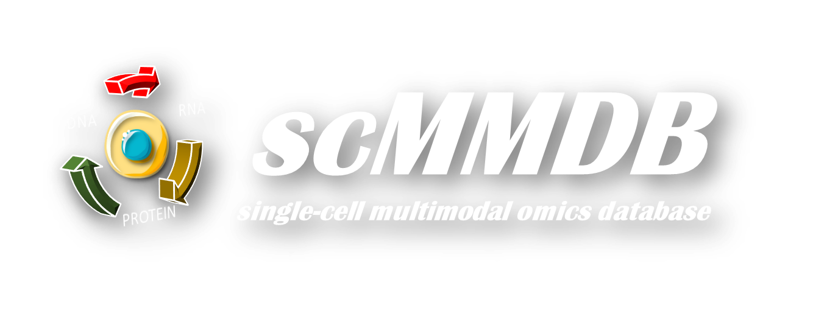

pymmdb Documentation
------------------------

pymmdb is a Python package for accessing the scMMDB database.

.. .. image:: _static/logo.png
..     :align: center
..     :alt: scMMDB

   Single-cell Multimodal Omics DataBase

**scMMDB: a comprehensive resource and knowledgebase for multimodal omics data at the single-cell resolution**

Single-Cell Multimodal Omics DataBase (`scMMDB`_) is a comprehensive repository for general paired single-cell multimodal omics data, 
encompassing both epigenomics, transcriptomics and proteomics data, and provides dataset/element search, visualization and download with unified formats.

.. _scMMDB: https://mmdb.piaqia.com/

Reference
---------

.. code-block:: latex

    In preparation for publication

For Users
---------

.. toctree::
    :maxdepth: 1

    Installation <1.installation>
    Tutorial <2.tutorial>
    API Reference <3.api>
    About us <4.about>
